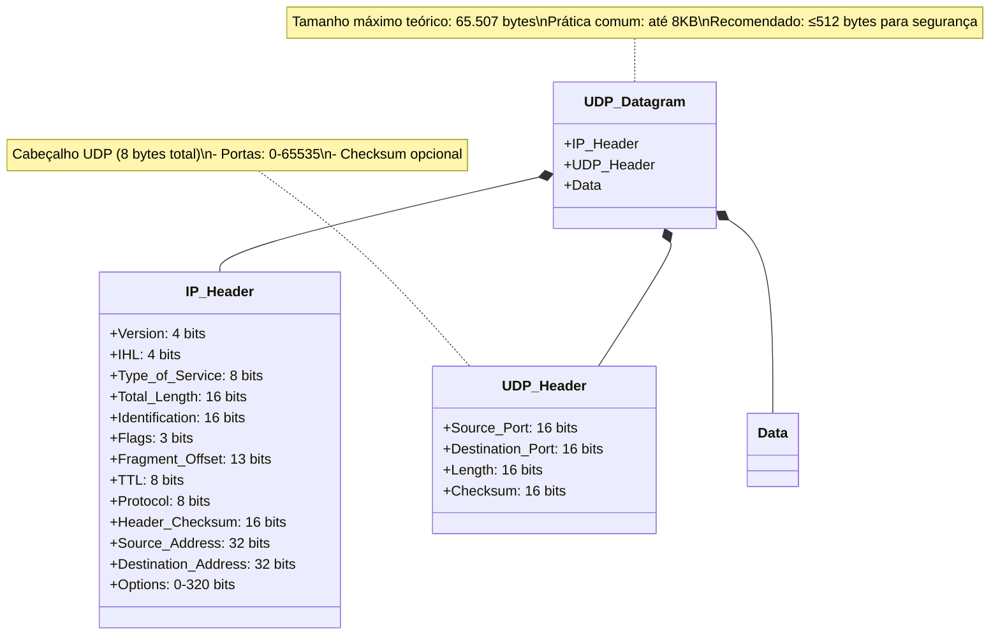

## UDP

O TCP foi projetado para a transmissão confiável de dados. Se os dados forem perdidos ou corrompidos durante a transmissão, o TCP garante que eles sejam reenviados.
Se os pacotes de dados chegarem fora de ordem, o TCP os reorganiza na sequência correta. Se os dados estiverem sendo transmitidos rápido demais para a conexão, o TCP reduz a velocidade para evitar a perda de pacotes.

Um programa nunca precisa se preocupar em receber dados fora de ordem ou incorretos. No entanto, essa confiabilidade tem um custo: a velocidade.

Estabelecer e encerrar conexões TCP pode levar um tempo considerável, especialmente para protocolos como o HTTP, que geralmente exigem muitas transmissões curtas.

O User Datagram Protocol (UDP) é um protocolo alternativo de transporte para envio de dados sobre IP que é muito rápido, mas não é confiável.

Ao enviar dados via UDP, não há como saber se eles chegaram ao destino, muito menos se as diferentes partes dos dados chegaram na mesma ordem em que foram enviadas. No entanto, as partes que de fato chegam geralmente chegam rapidamente.

##### The UDP Protocol

A pergunta óbvia é: por que alguém usaria um protocolo não confiável? Afinal, se você tem dados importantes para enviar, é essencial que eles cheguem corretamente, certo? Claramente, o UDP não é adequado para aplicações como o FTP, que exigem transmissão confiável em redes potencialmente instáveis. No entanto, há muitos casos em que a **velocidade bruta** é mais importante do que garantir cada bit.

Por exemplo, em **áudio ou vídeo em tempo real**, pacotes perdidos ou fora de ordem simplesmente causam ruído (como estática). Um pouco de ruído é tolerável, mas pausas na transmissão — causadas quando o TCP solicita retransmissão ou espera por um pacote perdido — são inaceitáveis.

Em outras aplicações, testes de confiabilidade podem ser implementados na **camada de aplicação**. Por exemplo, se um cliente envia uma requisição curta via UDP e não recebe resposta em um tempo determinado, ele pode assumir que o pacote foi perdido — é assim que o **DNS (Domain Name System)** funciona (embora o DNS também possa usar TCP).

Além disso, é possível implementar protocolos de transferência confiáveis sobre UDP, como o **NFS (Network File System)**, **TFTP (Trivial FTP)** e **FSP**. Nesses casos, a aplicação é responsável pela confiabilidade — o UDP não cuida disso. Isso exige mais trabalho (como lidar com pacotes perdidos ou fora de ordem), mas pode valer a pena em cenários onde a velocidade é crítica.

###### **Analogia entre TCP e UDP:**

- **TCP** é como uma **ligação telefônica**: a conexão é estabelecida, e você sabe que a outra parte ouve suas palavras na ordem certa. Se a chamada falhar, você percebe imediatamente.
- **UDP** é como o **correio**: você envia cartas (pacotes) sem garantia de que todas chegarão ou na ordem correta. Se precisar de confiabilidade, você mesmo deve numerar as cartas e pedir confirmação.

###### **Implementação do UDP em Java:**

O UDP no Java é dividido em duas classes principais:
1. **`DatagramPacket`**: Armazena os dados a serem enviados ou recebidos.
2. **`DatagramSocket`**: Envia e recebe os pacotes (datagramas).

Diferente do TCP (que usa `Socket` e `ServerSocket` e trata a comunicação como um **fluxo contínuo**), o UDP trabalha com **pacotes individuais**, sem conexões dedicadas. Um único `DatagramSocket` pode enviar e receber dados de vários hosts, mas cabe à aplicação gerenciar a ordem e a confiabilidade.

###### **Resumo Final:**
- **TCP** é **confiável**, mas mais lento — ideal para transferências de arquivos, emails, etc.
- **UDP** é **rápido**, mas não confiável — melhor para streaming, jogos online e DNS.
- Em Java, o UDP usa `DatagramPacket` e `DatagramSocket`, enquanto o TCP usa fluxos de entrada/saída.

Se você precisa de velocidade e pode tolerar alguma perda de dados, o UDP é a escolha certa. Caso contrário, o TCP é mais seguro.

###### UDP Clients

Vamos começar com um exemplo simples. Como em "Lendo de servidores com sockets" na página 240, vamos nos conectar ao servidor daytime do National Institute for Standards and Technology (NIST) para obter a hora atual. Mas desta vez usando UDP em vez de TCP. Lembre-se que o servidor daytime escuta na porta 13 e envia a hora em formato legível antes de fechar a conexão.

Agora, vejamos como obter esses dados programaticamente usando UDP. Primeiro, abra um socket na porta 0:

```java
DatagramSocket socket = new DatagramSocket(0);
```

Isso é bem diferente de um socket TCP. Você só especifica uma porta local para conexão. O socket não conhece o host ou endereço remoto. Especificando a porta 0, você pede ao Java para escolher uma porta disponível aleatória, similar aos server sockets.

O próximo passo é opcional, mas altamente recomendado: definir um timeout usando `setSoTimeout()`. Timeouts são medidos em milissegundos, então este código define 10 segundos de espera:

```java
socket.setSoTimeout(10000);
```

Timeouts são ainda mais importantes em UDP que em TCP, pois muitos problemas que gerariam exceções em TCP falham silenciosamente em UDP. Por exemplo, se o host remoto não estiver escutando na porta alvo, você nunca será notificado.

Agora prepare os pacotes. Você precisará de dois: um para enviar e outro para receber. Para o protocolo daytime, o conteúdo do pacote não importa, mas você precisa especificar o host e porta remotos:

```java
InetAddress host = InetAddress.getByName("time.nist.gov");
DatagramPacket request = new DatagramPacket(new byte[1], 1, host, 13);
```

O pacote de resposta só precisa de um array de bytes vazio, grande o suficiente para a resposta completa (1KB é suficiente):

```java
byte[] data = new byte[1024];
DatagramPacket response = new DatagramPacket(data, data.length);
```

Agora envie o pacote e receba a resposta:

```java
socket.send(request);
socket.receive(response);
```

Finalmente, converta os bytes recebidos em uma string legível:

```java
String daytime = new String(response.getData(), 0, response.getLength(), "US-ASCII");
System.out.println(daytime);
```

Como esses métodos podem lançar exceções, é recomendado usar um bloco try. Em Java 7+, você pode usar try-with-resources:

```java
try (DatagramSocket socket = new DatagramSocket(0)) {
    // código de conexão...
} catch (IOException ex) {
    System.err.println("Could not connect to time.nist.gov");
}
```

Em Java 6 ou anterior, feche o socket manualmente:

```java
DatagramSocket socket = null;
try {
    socket = new DatagramSocket(0);
    // código de conexão...
} finally {
    if (socket != null) socket.close();
}
```

O Exemplo 12-1 mostra o código completo. A saída será similar à versão TCP:

```
56375 13-04-11 19:55:22 50 0 0 843.6 UTC(NIST) *
```

##### UDP Servers

Um servidor UDP segue um padrão similar ao cliente UDP, mas com duas diferenças principais:
1. Normalmente recebe dados antes de enviar
2. Não usa uma porta anônima (usa uma porta específica)

Ao contrário do TCP, não existe uma classe separada como `DatagramServerSocket`.

**1. Abrindo o socket:**
```java
DatagramSocket socket = new DatagramSocket(13); // Porta 13 é o padrão para daytime
```
*Observação:* Em sistemas Unix/Linux/Mac, você precisa ser root para usar portas abaixo de 1024.

**2. Preparando para receber dados:**
```java
DatagramPacket request = new DatagramPacket(new byte[1024], 0, 1024);
```

**3. Recebendo a requisição:**
```java
socket.receive(request); // Bloqueia até receber um pacote
```

**4. Preparando a resposta:**
```java
String daytime = new Date().toString() + "\r\n";
byte[] data = daytime.getBytes("US-ASCII");
InetAddress host = request.getAddress(); // Pega o endereço do cliente
int port = request.getPort(); // Pega a porta do cliente
DatagramPacket response = new DatagramPacket(data, data.length, host, port);
```

**5. Enviando a resposta:**
```java
socket.send(response);
```

###### Exemplo Completo (Servidor Daytime)

```java
import java.net.*;
import java.util.Date;
import java.util.logging.*;
import java.io.*;

public class DaytimeUDPServer {
    private final static int PORT = 13;
    private final static Logger audit = Logger.getLogger("requests");
    private final static Logger errors = Logger.getLogger("errors");

    public static void main(String[] args) {
        try (DatagramSocket socket = new DatagramSocket(PORT)) {
            while (true) {
                try {
                    DatagramPacket request = new DatagramPacket(new byte[1024], 1024);
                    socket.receive(request);
                    
                    String daytime = new Date().toString();
                    byte[] data = daytime.getBytes("US-ASCII");
                    
                    DatagramPacket response = new DatagramPacket(data, data.length,
                            request.getAddress(), request.getPort());
                    socket.send(response);
                    
                    audit.info(daytime + " " + request.getAddress());
                } catch (IOException | RuntimeException ex) {
                    errors.log(Level.SEVERE, ex.getMessage(), ex);
                }
            }
        } catch (IOException ex) {
            errors.log(Level.SEVERE, ex.getMessage(), ex);
        }
    }
}
```

###### Características dos Servidores UDP:
- Geralmente não são multithread (como os servidores TCP)
- Normalmente não realizam processamento complexo para cada cliente
- Trabalham bem com abordagem iterativa (sem threads), já que o UDP não fica bloqueado esperando respostas

Este servidor fica em loop infinito, respondendo a cada requisição com a data/hora atual e registrando as atividades em logs.


##### The DatagramPacket Class


Os datagramas UDP adicionam muito pouco aos datagramas IP sobre os quais são construídos. O cabeçalho UDP adiciona apenas 8 bytes ao cabeçalho IP. Ele contém:

- Números de porta de origem e destino
- O comprimento de tudo que segue o cabeçalho IP
- Uma soma de verificação (checksum) opcional

Como as portas são representadas por inteiros não assinados de 2 bytes, existem 65.536 portas UDP disponíveis por host (distintas das 65.536 portas TCP). O campo de comprimento também usa 2 bytes, limitando o tamanho do datagrama a 65.536 bytes (menos os 8 bytes do cabeçalho). Na prática, esse limite é redundante com o campo de comprimento do cabeçalho IP, que restringe os datagramas a entre 65.467 e 65.507 bytes (dependendo do tamanho do cabeçalho IP).

O checksum é opcional e não está acessível para aplicações. Se a verificação falhar, o software de rede descarta silenciosamente o datagrama - nenhuma notificação é enviada ao remetente ou destinatário. Afinal, UDP é um protocolo não confiável.

###### Limitações Práticas

Embora o limite teórico seja de ~65KB, na prática:
- Muitas plataformas impõem um limite de 8KB (8.192 bytes)
- Implementações podem recusar datagramas com mais de 576 bytes no total
- Pacotes maiores frequentemente são truncados para 8KB

Para máxima segurança, recomenda-se manter os dados em até 512 bytes, embora isso possa impactar o desempenho. (O TCP esconde esses detalhes com sua API baseada em fluxo.)

###### A Classe DatagramPacket em Java

Em Java, um datagrama UDP é representado pela classe `DatagramPacket`:

```java
public final class DatagramPacket extends Object
```

Esta classe oferece métodos para:
- Obter/configurar endereços de origem/destino
- Obter/configurar portas de origem/destino
- Obter/configurar os dados
- Obter/configurar o comprimento dos dados

Os demais campos do cabeçalho não são acessíveis via Java puro.




Principais características mostradas:
1. Estrutura hierárquica do datagrama UDP dentro do pacote IP
2. Campos do cabeçalho IP (simplificado)
3. Campos do cabeçalho UDP (4 campos de 16 bits cada)
4. Área de dados
5. Anotações com informações importantes sobre:
    - Tamanho do cabeçalho UDP
    - Faixa de portas
    - Natureza opcional do checksum
    - Limites de tamanho práticos


##### The Constructors

A classe `DatagramPacket` utiliza construtores diferentes dependendo se o pacote será usado para **enviar** ou **receber** dados. Isso é um pouco incomum. Normalmente, os construtores são sobrecarregados para permitir que você forneça diferentes tipos de informações ao criar um objeto, não para criar objetos da mesma classe que serão usados em contextos diferentes.

###### Construtores para Receber Dados

No caso de pacotes para **recebimento**, os construtores exigem apenas dois argumentos:
1. Um array de bytes (`byte[]`) que servirá como buffer para armazenar os dados recebidos
2. O número de bytes desse array que devem ser usados para os dados do datagrama

Quando o socket recebe um datagrama da rede, ele armazena os dados no array de buffer do objeto `DatagramPacket`, até o limite de bytes especificado.

###### Construtores para Enviar Dados

O segundo grupo de construtores do `DatagramPacket` é usado para criar datagramas que serão **enviados** pela rede. Além do array de bytes e do comprimento, esses construtores exigem:
1. O endereço de destino (IP)
2. A porta de destino

Neste caso, você passa para o construtor:
- Um array de bytes contendo os dados a serem enviados
- O endereço e porta do destinatário

O `DatagramSocket` lê o endereço e porta de destino diretamente do pacote. Diferente do TCP, essas informações **não ficam armazenadas no socket** - elas estão contidas no próprio pacote.

###### Comparação com TCP

Essa abordagem contrasta com o TCP, onde:
- O endereço/porta de destino fica associado ao socket
- A comunicação é orientada a conexão
- Não é necessário especificar destino a cada envio

No UDP, como não há conexão persistente, cada pacote deve carregar consigo as informações completas de destino.


##### Constructors for receiving datagrams


Estes dois construtores criam objetos `DatagramPacket` para receber dados da rede:

1. **Construtor Básico**
   ```java
   public DatagramPacket(byte[] buffer, int length)
   ```
    - Armazena os dados recebidos a partir do início do buffer (`buffer[0]`).
    - Exemplo:
      ```java
      byte[] buffer = new byte[8192];
      DatagramPacket dp = new DatagramPacket(buffer, buffer.length);
      ```

2. **Construtor com Offset**
   ```java
   public DatagramPacket(byte[] buffer, int offset, int length)
   ```
    - Armazena os dados a partir de uma posição específica (`buffer[offset]`).
    - `length` deve ser ≤ `buffer.length - offset` (senão lança `IllegalArgumentException`).

###### Observações Importantes:

- **Tamanho do Buffer**:
    - Embora Java permita buffers grandes (até 65.507 bytes para IPv4 ou 65.536 para IPv6), a maioria das implementações de rede suporta no máximo **8.192 bytes (8KB)** por datagrama.
    - Protocolos comuns (DNS, TFTP) usam pacotes menores (≤ 512 bytes).
    - Sistemas operacionais podem truncar ou descartar pacotes maiores que 8KB **sem notificação**.

- **Boas Práticas**:
    - Use buffers de até **8KB** para evitar perda de dados.
    - Buffers menores que o tamanho máximo são aceitos (apenas `length` bytes serão preenchidos).

###### Exemplo de Risco:

```java
byte[] hugeBuffer = new byte[65507]; // Teoricamente válido, mas arriscado!
DatagramPacket dp = new DatagramPacket(hugeBuffer, hugeBuffer.length);
// Pode falhar silenciosamente na rede se o pacote exceder 8KB.
```

###### Conclusão:

Prefira buffers de **até 8KB** para garantir compatibilidade com a maioria das redes e sistemas. Buffers maiores podem causar perda de dados sem aviso.


##### Constructors for sending datagrams

Estes quatro construtores criam novos objetos `DatagramPacket` usados para **enviar dados** pela rede:

```java
public DatagramPacket(byte[] data, int length, InetAddress destination, int port)
public DatagramPacket(byte[] data, int offset, int length, InetAddress destination, int port)
public DatagramPacket(byte[] data, int length, SocketAddress destination)
public DatagramPacket(byte[] data, int offset, int length, SocketAddress destination)
```

###### Funcionamento:
1. **Preenchimento do Pacote**:
    - O pacote é preenchido com `length` bytes do array `data`.
    - Se houver `offset`, os dados começam nessa posição; caso contrário, começam em `0`.

2. **Validação**:
    - Se `length` for maior que `data.length` (ou maior que `data.length - offset`), o construtor lança uma `IllegalArgumentException`.
    - É permitido deixar espaços não utilizados no final do array (`length` pode ser menor que o espaço disponível).

3. **Destino**:
    - `destination` (do tipo `InetAddress` ou `SocketAddress`) especifica o host de destino.
    - `port` indica a porta do host que receberá o pacote.

###### Observação:

Apenas `length` bytes serão enviados — mesmo que o array `data` seja maior. O UDP não usa conexões persistentes, então cada pacote deve conter **todas as informações de destino** (diferente do TCP, onde o destino é associado ao socket).

Exemplo de uso:
```java
byte[] dados = "Olá, UDP!".getBytes("UTF-8");
InetAddress destino = InetAddress.getByName("example.com");
DatagramPacket pacote = new DatagramPacket(dados, dados.length, destino, 1234);
// Envia apenas os bytes válidos do array, ignorando espaços extras.
```


##### Choosing a Datagram Size

**Tamanho ideal de pacotes UDP**  
A quantidade adequada de dados em um pacote varia conforme o cenário:
- **Protocolos específicos** (como `rlogin`) usam pacotes pequenos (ex.: 1 byte + cabeçalhos).
- **Transferências de arquivo** são mais eficientes com pacotes grandes, respeitando o tamanho máximo permitido (geralmente **8KB**).

**Fatores para escolha do tamanho**:
- Redes instáveis (ex.: rádio-pacote) → Pacotes **menores** (reduzem corrupção).
- LANs rápidas e estáveis → Pacotes **maiores** (otimizam throughput).
- **8KB (8.192 bytes)** é um bom equilíbrio para a maioria das redes.

**Preparação dos dados**:
1. Converta os dados para um array de bytes (`byte[]`) antes de criar o `DatagramPacket`.
2. **Cuidado**: Alterar o array *após* criar o pacote modifica o conteúdo a ser enviado (não há cópia interna).
    - *Aplicação útil*: Atualizar dados dinâmicos (ex.: enviar leituras de sensores a cada minuto).
    - *Risco*: Em programas multithread, proteja o buffer com cópias temporárias para evitar inconsistências.

**Exemplo prático**:
```java
String mensagem = "Este é um teste";
byte[] dados = mensagem.getBytes("UTF-8"); // Conversão para bytes
try {
    InetAddress destino = InetAddress.getByName("www.ibiblio.org");
    int porta = 7; // Porta echo
    DatagramPacket pacote = new DatagramPacket(dados, dados.length, destino, porta);
    // Enviar o pacote...
} catch (IOException ex) { /* Tratar erro */ }
```

**Dica**: Use `ByteArrayOutputStream` (do pacote `java.io`) para facilitar a construção de arrays de bytes complexos.

**Pontos-chave**:
- Pacotes grandes melhoram eficiência, mas redes instáveis exigem cautela.
- Garanta a **imutabilidade** dos dados durante o envio em ambientes concorrentes.
- Converta strings ou objetos para `byte[]` adequadamente (ex.: com `getBytes("UTF-8")`).


##### The get Methods

A classe `DatagramPacket` possui seis métodos principais para recuperar informações de datagramas UDP, especialmente úteis para pacotes **recebidos** da rede:

---

###### **1. `getAddress()`**
- **Retorno**: Um objeto `InetAddress` com o endereço do host remoto.
- **Uso**:
    - Se o datagrama foi **recebido**, retorna o endereço de origem (quem enviou).
    - Se foi **criado para envio**, retorna o endereço de destino.
- **Aplicação**: Identificar o remetente para enviar uma resposta.

###### **2. `getPort()`**
- **Retorno**: Um `int` com a porta remota.
- **Uso**:
    - Para pacotes recebidos: retorna a porta de origem.
    - Para pacotes de envio: retorna a porta de destino.

###### **3. `getSocketAddress()`**
- **Retorno**: Um `SocketAddress` (combina IP e porta).
- **Vantagem**: Útil para APIs como `DatagramChannel` (E/S não bloqueante).
- **Equivalente**: Equivale a chamar `getAddress()` + `getPort()`.

---

###### **4. `getData()`**
- **Retorno**: O array de bytes (`byte[]`) com os dados do pacote.
- **Conversões comuns**:
    - **Para texto**:
      ```java  
      String texto = new String(dp.getData(), "UTF-8");  
      ```  
    - **Para dados binários**:
      ```java  
      InputStream in = new ByteArrayInputStream(  
          packet.getData(), packet.getOffset(), packet.getLength()  
      );  
      DataInputStream din = new DataInputStream(in);  
      ```  
      *(Assume que o remetente usa formatos compatíveis com Java, como inteiros em **big-endian**)*.

###### **5. `getLength()`**
- **Retorno**: O número de bytes **úteis** no array (pode ser menor que `getData().length`).

###### **6. `getOffset()`**
- **Retorno**: A posição inicial dos dados no array retornado por `getData()`.

---

###### **Exemplo Prático (Exemplo 12-3)**
```java  
DatagramPacket dp = new DatagramPacket(data, data.length, ia, port);  
System.out.println("Endereço: " + dp.getAddress() + ", Porta: " + dp.getPort());  
System.out.println("Bytes úteis: " + dp.getLength());  
System.out.println("Conteúdo: " +  
    new String(dp.getData(), dp.getOffset(), dp.getLength(), "UTF-8"));  
```  

**Saída**:
```  
Endereço: www.ibiblio.org/152.2.254.81, Porta: 7  
Bytes úteis: 15  
Conteúdo: This is a test.  
```  

---

###### **Observações Importantes**:
- **Buffer de dados**: O array retornado por `getData()` pode conter espaços não utilizados (preenchidos com lixo). Sempre use `getLength()` e `getOffset()` para evitar processar dados inválidos.
- **Thread safety**: Se o `DatagramPacket` for compartilhado entre threads, copie os dados antes de manipulá-los para evitar corrupção.

Este resumo cobre os principais métodos para extrair informações de datagramas UDP em Java, com exemplos práticos de uso.

##### The setter Methods


Os 6 construtores de `DatagramPacket` geralmente são suficientes, mas Java também oferece métodos para modificar pacotes **após a criação** - útil para otimizar performance em cenários como jogos online que enviam muitos pacotes pequenos.

###### Métodos Principais:

1. **`setData(byte[] data)`**
    - Altera os dados do pacote.
    - Exemplo: Enviar um arquivo grande em partes reutilizando o mesmo pacote.

2. **`setData(byte[] data, int offset, int length)`**
    - Envia pedaços de um array grande:
   ```java
   while (bytesEnviados < arrayGrande.length) {
       socket.send(pacote);
       bytesEnviados += pacote.getLength();
       pacote.setData(arrayGrande, bytesEnviados, tamanhoDoPedaco); 
   }
   ```
    - *Cuidado*: Sem confirmação de recebimento, pode perder dados.

3. **`setAddress(InetAddress destino)`**
    - Muda o IP de destino.
    - Exemplo: Enviar a mesma mensagem para vários IPs em uma rede (ex: `128.238.5.1` a `128.238.5.255`).
    - *Melhor alternativa*: Para redes locais, use **IP de broadcast** (ex: `128.238.255.255`) ou *multicast* (Capítulo 13).

4. **`setPort(int porta)`**
    - Muda a porta de destino.
    - Usos: Scanners de porta ou jogos multijogador com clientes em portas diferentes.

5. **`setSocketAddress(SocketAddress destino)`**
    - Define IP e porta juntos (útil para respostas):
   ```java
   pacoteResposta.setSocketAddress(pacoteRecebido.getSocketAddress());
   ```

6. **`setLength(int tamanho)`**
    - Ajusta o tamanho útil do buffer.
    - Importante ao **receber** pacotes: evita truncamento em recebimentos subsequentes.

---

###### Exemplo Prático:
```java
// Recebe um pacote e responde ao remetente
DatagramPacket entrada = new DatagramPacket(new byte[8192], 8192);
socket.receive(entrada);

DatagramPacket saida = new DatagramPacket("Olá!".getBytes("UTF-8"), 5);
saida.setSocketAddress(entrada.getSocketAddress()); // Responde ao mesmo IP/porta
socket.send(saida);
```

---

###### Observações:
- **Reutilizar pacotes** melhora performance, mas exige cuidado com threads.
- **Broadcast/Multicast** são alternativas eficientes para envios em massa.
- Sempre use `setLength()` ao reutilizar pacotes para recebimento.

Esses métodos são úteis para otimização, mas a maioria dos programas pode usar os construtores sem problemas.


##### The DatagramSocket Class

Para enviar ou receber um `DatagramPacket`, você precisa abrir um **socket de datagrama**. Em Java, esse socket é criado e acessado através da classe `DatagramSocket`:

```java
public class DatagramSocket extends Object
```

###### Funcionamento Básico:
- **Todos os sockets de datagrama** estão vinculados a uma **porta local**, usada para:
    - Escutar dados recebidos.
    - Inserir no cabeçalho de datagramas enviados.

###### Diferença entre Cliente e Servidor:
1. **Para clientes**:
    - Normalmente não importa qual porta local é usada.
    - O sistema atribui automaticamente uma **porta anônima** (não utilizada) via construtores específicos.
    - Essa porta é incluída nos datagramas enviados, permitindo que o servidor saiba para onde enviar respostas.

2. **Para servidores**:
    - Os clientes precisam conhecer a porta em que o servidor escuta.
    - O servidor especifica uma **porta bem conhecida** (ex: porta 13 para daytime) ao criar o `DatagramSocket`.

###### Observações Importantes:
- **Não há distinção** entre sockets de cliente e servidor (diferente do TCP, que tem `Socket` e `ServerSocket`).
- **Não existe** uma classe `DatagramServerSocket` — o mesmo `DatagramSocket` é usado para ambos os lados.

###### Exemplo Prático:
```java
// Cliente (porta anônima)
DatagramSocket clienteSocket = new DatagramSocket();

// Servidor (porta fixa)
DatagramSocket servidorSocket = new DatagramSocket(13); // Porta 13 para daytime
```

Essa flexibilidade simplifica a comunicação UDP, onde o mesmo socket pode ser usado para enviar e receber pacotes indiscriminadamente.

##### The Constructors

Os construtores de `DatagramSocket` servem para diferentes situações:

1. **Construtor Básico (Porta Anônima)**
   ```java
   public DatagramSocket() throws SocketException
   ```
    - Usado por **clientes** que iniciam comunicação
    - O sistema escolhe automaticamente uma porta livre
    - Exemplo:
      ```java
      try {
          DatagramSocket cliente = new DatagramSocket();
          // enviar pacotes...
      } catch (SocketException ex) {
          System.err.println("Erro ao criar socket: " + ex);
      }
      ```
    - Ideal quando você não precisa controlar a porta local
    - Raramente falha (o sistema sempre encontra uma porta disponível)

2. **Construtor com Porta Específica**
   ```java
   public DatagramSocket(int porta) throws SocketException
   ```
    - Usado por **servidores** que escutam em portas conhecidas
    - Pode falhar se:
        - A porta já estiver em uso
        - Tentar usar porta abaixo de 1024 sem privilégios (em Unix)
    - Exemplo para servidor daytime (porta 13):
      ```java
      try {
          DatagramSocket servidor = new DatagramSocket(13);
          // receber pacotes...
      } catch (SocketException ex) {
          System.err.println("Não pude criar socket na porta 13: " + ex);
      }
      ```

##### Observações Importantes:
- O `DatagramSocket` só gerencia **porta local** - o endereço remoto fica no `DatagramPacket`
- Um mesmo socket pode se comunicar com vários hosts/portas remotas
- Em clientes, normalmente não importa qual porta local é usada
- Servidores precisam usar portas fixas conhecidas pelos clientes

##### Dica:

Use `getLocalPort()` para descobrir qual porta foi atribuída automaticamente quando usar o construtor sem argumentos.


>Eu, dado interresante,  na pagina 434:
>Portas TCP e UDP não estão relacionadas. Dois programas diferentes podem usar o mesmo número de porta se um usar UDP e o outro usar TCP

###### Scanner de Portas UDP

Este exemplo verifica portas UDP locais em uso no computador:

```java
import java.net.*;

public class ScannerPortasUDP {
    public static void main(String[] args) {
        // Verifica portas de 1024 até 65535
        for (int porta = 1024; porta <= 65535; porta++) {
            try {
                // Tenta criar um socket na porta
                DatagramSocket servidor = new DatagramSocket(porta);
                servidor.close(); // Se funcionou, a porta está livre
            } catch (SocketException ex) {
                System.out.println("Tem um servidor na porta " + porta + ".");
            }
        }
    }
}
```

###### Funcionamento:
1. O programa tenta criar sockets UDP em cada porta
2. Se falhar (`SocketException`), significa que já existe um serviço usando aquela porta
3. Começa na porta 1024 para evitar restrições do Unix (que exige root para portas abaixo de 1024)

###### Exemplo de Saída:
```
Tem um servidor na porta 2049.
Tem um servidor na porta 32768.
Tem um servidor na porta 32770.
```

###### Serviços Comuns Encontrados:
- **Porta 2049**: Servidor NFS (Sistema de Arquivos em Rede)
- **Portas ~30000**: Serviços RPC (Chamada Remota de Procedimentos)

###### Limitação Importante:
- Scanner UDP é menos confiável que TCP
- Para confirmar se um serviço UDP remoto está ativo, é preciso enviar um pacote que ele reconheça e responda
- UDP não dá confirmação de recebimento como o TCP faz

###### Adaptações Possíveis:
- Se tiver permissão de root (Unix) ou usar Windows, pode verificar portas abaixo de 1024 também


##### 1. Construtor para Interfaces Específicas
```java
public DatagramSocket(int porta, InetAddress interface) throws SocketException
```
- **Uso principal**: Computadores com múltiplas interfaces de rede (multihomed)
- **Funcionamento**:
    - Cria um socket que escuta apenas em:
        - Uma **porta específica**
        - Uma **interface de rede específica** (definida pelo endereço `InetAddress`)
- **Restrições**:
    - Em Unix, requer permissão de root para portas abaixo de 1024
- **Falhas comuns** (lança `SocketException`):
    1. Porta já em uso
    2. Tentativa de usar porta <1024 sem privilégios (Unix)
    3. Endereço não corresponde a nenhuma interface do sistema

---

##### 2. Construtor com SocketAddress
```java
public DatagramSocket(SocketAddress interface) throws SocketException
```
- **Funcionamento similar** ao anterior, mas usa um objeto `SocketAddress`
- **Exemplo** (escuta apenas no endereço local 127.0.0.1, porta 9999):
  ```java
  SocketAddress endereco = new InetSocketAddress("127.0.0.1", 9999);
  DatagramSocket socket = new DatagramSocket(endereco);
  ```

---

##### 3. Construtor para Implementações Customizadas (Avançado)
```java
protected DatagramSocket(DatagramSocketImpl impl) throws SocketException
```
- **Uso**: Para subclasses que precisam implementar versões customizadas do protocolo UDP
- **Diferença**: Socket **não é vinculado automaticamente** a uma porta/endereço
- **Requer binding manual** antes do uso:
  ```java
  socket.bind(new InetSocketAddress(porta)); // Vincula a porta
  // ou
  socket.bind(null); // Usa porta e endereço disponíveis aleatórios
  ```

---

##### Comparação Resumida
| Construtor | Uso Típico | Vinculação Automática? |
|------------|------------|------------------------|
| `DatagramSocket(porta, InetAddress)` | Servidores em hosts com múltiplas redes | Sim |
| `DatagramSocket(SocketAddress)` | Servidores com configuração de rede/porta específica | Sim |
| `protected DatagramSocket(...)` | Implementações customizadas de UDP | Não (requer `bind()`) |

**Dica**: Para aplicações comuns, os primeiros dois construtores são suficientes. O terceiro é para casos avançados de personalização de rede.


##### Sending and Receiving Datagrams

A principal função da classe `DatagramSocket` é **enviar e receber datagramas UDP**. Um mesmo socket pode:
- Enviar **e** receber dados
- Se comunicar com **múltiplos hosts** ao mesmo tempo

###### Método `send()` - Enviar Pacotes

```java
public void send(DatagramPacket dp) throws IOException
```
**Como usar**:
1. Crie um `DatagramPacket` com os dados
2. Passe o pacote para o método `send()` do socket:
   ```java
   socket.send(pacote);
   ```

**Possíveis erros** (raros em UDP):
1. `IOException` (exceção de I/O) pode ocorrer se:
    - O pacote for **muito grande** para a rede
    - Problemas no sistema operacional (depende do software de rede nativo)

2. `SecurityException` (exceção de segurança) pode aparecer se:
    - Um `SecurityManager` bloquear a comunicação (comum em applets)

**Observação importante**:  
Como UDP é **não confiável**, você **NÃO** receberá erros se:
- O pacote se perder na rede
- O destino estiver inativo
- Houver outros problemas de entrega

###### Exemplo Prático
```java
try {
    DatagramSocket socket = new DatagramSocket(); // Socket UDP
    byte[] dados = "Olá UDP!".getBytes("UTF-8");
    
    // Prepara o pacote para enviar ao servidor (exemplo: porta 1234)
    DatagramPacket pacote = new DatagramPacket(
        dados, 
        dados.length, 
        InetAddress.getByName("servidor.com"), 
        1234
    );
    
    socket.send(pacote); // Envia o pacote
} catch (IOException ex) {
    System.err.println("Erro ao enviar: " + ex.getMessage());
}
```

###### Por que UDP é diferente?
- **TCP**: Notifica erros (ex.: conexão falhou)
- **UDP**: "Envia e esquece" - não garante entrega nem notifica falhas

###### Cliente UDP de Descarte

```java
import java.net.*;
import java.io.*;

public class ClienteDescarteUDP {
    public static final int PORTA = 9; // Porta padrão do protocolo discard
    
    public static void main(String[] args) {
        String host = args.length > 0 ? args[0] : "localhost";
        
        try (DatagramSocket socket = new DatagramSocket()) {
            InetAddress servidor = InetAddress.getByName(host);
            BufferedReader entrada = new BufferedReader(new InputStreamReader(System.in));
            
            while (true) {
                String texto = entrada.readLine();
                if (texto.equals(".")) break;
                
                byte[] dados = texto.getBytes();
                DatagramPacket pacote = new DatagramPacket(dados, dados.length, servidor, PORTA);
                socket.send(pacote);
            }
        } catch (IOException ex) {
            System.err.println("Erro: " + ex);
        }
    }
}
```

**Funcionamento**:
1. Conecta ao servidor discard (porta 9)
2. Lê texto do teclado e envia linha por linha
3. Termina quando digitar um ponto (.)
4. Não espera resposta (protocolo discard simplesmente ignora os dados)


###### Servidor UDP de Descarte

```java
import java.net.*;
import java.io.*;

public class ServidorDescarteUDP {
    public static final int PORTA = 9;
    public static final int TAMANHO_MAXIMO = 65507; // Tamanho máximo UDP
    
    public static void main(String[] args) {
        byte[] buffer = new byte[TAMANHO_MAXIMO];
        
        try (DatagramSocket servidor = new DatagramSocket(PORTA)) {
            DatagramPacket pacote = new DatagramPacket(buffer, buffer.length);
            
            while (true) {
                servidor.receive(pacote);
                String mensagem = new String(pacote.getData(), 0, pacote.getLength(), "ISO-8859-1");
                System.out.println(pacote.getAddress() + ":" + pacote.getPort() + " disse: " + mensagem);
                pacote.setLength(buffer.length); // Prepara para próximo pacote
            }
        } catch (IOException ex) {
            System.err.println("Erro: " + ex);
        }
    }
}
```

**Funcionamento**:
1. Escuta na porta 9
2. Recebe qualquer datagrama UDP
3. Exibe o conteúdo e origem dos pacotes
4. Usa codificação ISO-8859-1 para mostrar qualquer byte

---

###### Métodos Importantes de DatagramSocket

###### `receive(DatagramPacket dp)`
- Bloqueia até receber um pacote
- Armazena dados no `DatagramPacket` fornecido
- Limite prático: 65.507 bytes (tamanho máximo UDP)

###### `close()`
- Libera a porta do socket
- **Importante** em programas de longa execução
- Formas de uso:
  ```java
  // Java 7+ (try-with-resources)
  try (DatagramSocket socket = new DatagramSocket()) {
      // usar o socket
  }
  
  // Versão tradicional
  finally {
      if (socket != null) socket.close();
  }
  ```

###### Métodos de Informação
```java
socket.getLocalPort();    // Retorna a porta local
socket.getLocalAddress(); // Retorna o endereço local
socket.getLocalSocketAddress(); // Combina porta e endereço
```

---

###### Boas Práticas
1. Sempre defina um tamanho máximo realista (ex: 8KB para NFS)
2. Reinicie o comprimento do pacote (`setLength`) após cada recebimento
3. Feche os sockets quando não forem mais necessários
4. Para programas simples que terminam rápido, o fechamento automático por GC é suficiente


##### Managing Connections

>Eu, tem um feature de segurança importante aqui.
>Um UDP aceita dados de todos, mas para um cliente e relevante enviar e receber somente do servidor que ele se popoem a receber dados e etc:
>Pagina, 440
>O método connect() não estabelece realmente uma conexão no sentido TCP. No entanto, ele especifica que o DatagramSocket enviará e receberá pacotes apenas do host remoto especificado na porta remota especificada. Tentativas de enviar pacotes para um host ou porta diferente gerarão uma IllegalArgumentException. Pacotes recebidos de um host ou porta diferente serão descartados sem exceção ou outra notificação.

Ao contrário dos sockets TCP, os sockets UDP normalmente se comunicam com qualquer host. Porém, você pode querer restringir isso:

###### `connect()` - Limitando Comunicação

```java
public void connect(InetAddress host, int port)
```
- **Não cria uma conexão real** como no TCP, mas define restrições:
    - Só envia/recebe pacotes do **host** e **porta** especificados
    - Tentativas de comunicação com outros endereços geram `IllegalArgumentException`
    - Pacotes de outras origens são **silenciosamente descartados**

- **Verificação de segurança**:
    - Ao conectar, verifica se a VM tem permissão para acessar o host/porta
    - Se permitido: conexão é estabelecida
    - Se negado: lança `SecurityException` (comum em applets)

- **Vantagem**: Após conectar, `send()`/`receive()` não fazem novas verificações de segurança.

###### `disconnect()` - Removendo Restrições

```java
public void disconnect()
```
- Volta a aceitar comunicação com qualquer host/porta.

###### Métodos de Informação

```java
// Retorna a porta remota (ou -1 se não conectado)
socket.getPort();

// Retorna o endereço remoto (ou null se não conectado)
socket.getInetAddress();

// Retorna o endereço completo (IP + porta) do remoto (ou null)
socket.getRemoteSocketAddress();
```

---

###### Exemplo Prático

```java
DatagramSocket socket = new DatagramSocket();

// Restringe comunicação apenas com example.com na porta 1234
socket.connect(InetAddress.getByName("example.com"), 1234);

// Agora só pode enviar/receber desse destino
socket.send(pacote);  // Só para example.com:1234
socket.receive(pacote); // Só aceita de example.com:1234

// Libera para comunicação com qualquer um
socket.disconnect();
```

###### Quando Usar?
- **Applets**: Para cumprir restrições de segurança (só comunicar com o host de origem)
- **Clientes específicos**: Como clientes NFS/FSP que devem aceitar apenas pacotes do servidor
- **Jogos online**: Para filtrar conexões de outros jogadores

###### Diferença Chave vs TCP
- UDP não mantém estado de conexão real, apenas filtra pacotes
- Mais eficiente para comunicações simples onde overhead de TCP é desnecessário


##### Socket Options

Java oferece 6 configurações importantes para sockets UDP:

1. **SO_TIMEOUT**
    - Define um tempo máximo de espera (em milissegundos) para operações de recebimento (`receive()`)
    - Exemplo: `socket.setSoTimeout(5000);` (espera até 5 segundos)

2. **SO_RCVBUF**
    - Controla o tamanho do buffer de recebimento (em bytes)
    - Útil para melhorar desempenho em redes rápidas

3. **SO_SNDBUF**
    - Define o tamanho do buffer de envio (em bytes)
    - Ajuste para otimizar transferências grandes

4. **SO_REUSEADDR**
    - Permite reutilizar portas imediatamente após fechamento
    - Evita erros do tipo "Address already in use"

5. **SO_BROADCAST**
    - Habilita/envia pacotes para endereços de broadcast
    - Necessário para comunicação em rede local

6. **IP_TOS**
    - Define a prioridade do tráfego (Qualidade de Serviço)
    - Valores comuns: baixa latência (0x10) ou alta taxa (0x08)

###### Como Usar

```java
DatagramSocket socket = new DatagramSocket();

// Exemplo de configurações:
socket.setSoTimeout(3000); // 3 segundos de timeout
socket.setReceiveBufferSize(8192); // Buffer de 8KB
socket.setBroadcast(true); // Permite broadcast
```

Estas opções ajudam a controlar melhor o comportamento da comunicação UDP em diferentes cenários de rede.


##### SO_TIMEOUT

**SO_TIMEOUT** é o tempo em milissegundos que o método `receive()` aguarda por um datagrama antes de lançar uma `InterruptedIOException` (subclasse de `IOException`). Seu valor deve ser não negativo. Se for **0**, `receive()` nunca expira. Esse valor pode ser alterado com `setSoTimeout()` e verificado com `getSoTimeout()`:

```java
public void setSoTimeout(int timeout) throws SocketException
public int getSoTimeout() throws IOException
```

Por padrão, não há timeout, e raramente é necessário configurá-lo. Pode ser útil em:
- Protocolos seguros que exigem respostas dentro de um tempo fixo.
- Identificar falhas em hosts inacessíveis ou sem resposta.

##### Como usar:
- `setSoTimeout()` define o tempo máximo de espera. Se expirar, `receive()` lança `SocketTimeoutException`.
- Deve ser configurado **antes** de chamar `receive()**.
- O valor deve ser **≥ 0**.

**Exemplo:**
```java
try {
  byte[] buffer = new byte[2056];
  DatagramPacket dp = new DatagramPacket(buffer, buffer.length);
  DatagramSocket ds = new DatagramSocket(2048);
  ds.setSoTimeout(30000); // Timeout de 30 segundos

  try {
    ds.receive(dp); // Processa o pacote...
  } catch (SocketTimeoutException ex) {
    System.err.println("Sem resposta em 30 segundos");
    ds.close();
  }
} catch (IOException ex) {
  System.err.println("Erro: " + ex);
}
```

**Verificação do timeout:**
```java
public void printSoTimeout(DatagramSocket ds) {
  int timeout = ds.getSoTimeout();
  if (timeout > 0) {
    System.out.println(ds + " expira em " + timeout + "ms");
  } else if (timeout == 0) {
    System.out.println(ds + " nunca expira");
  } else {
    System.out.println("Erro em " + ds);
  }
}
```

##### Pontos-chave:
- **0 = sem timeout** (comportamento padrão).
- Exceções ajudam a tratar falhas de comunicação.
- Configure o timeout **antes** de receber dados.

##### SO_RCVBUF

>Eu, informação importante:
> Buffers de recepção suficientemente grandes são ainda mais importantes para UDP do que para TCP, pois um datagrama UDP que chega quando o buffer está cheio será perdido, enquanto um datagrama TCP que chega com o buffer cheio será eventualmente retransmitido.

O **SO_RCVBUF** define o tamanho do buffer usado para operações de rede (I/O). Buffers maiores melhoram o desempenho em conexões rápidas (como Ethernet), pois armazenam mais datagramas antes de transbordar.

###### **Por que é importante no UDP?**

- No **UDP**, se o buffer estiver cheio, os datagramas são **perdidos**.
- No **TCP**, os pacotes são retransmitidos, mas no UDP **não há recuperação**.
- Além disso, o **SO_RCVBUF** define o tamanho máximo dos pacotes que o aplicativo pode receber. Pacotes maiores que o buffer são **descartados silenciosamente**.

###### **Métodos para Configurar o Buffer**

```java
public void setReceiveBufferSize(int size) throws SocketException  
public int getReceiveBufferSize() throws SocketException  
```  

- **`setReceiveBufferSize()`** sugere um tamanho (em bytes), mas a implementação do sistema pode ignorá-lo.
    - Exemplo: Alguns sistemas limitam o buffer a **52KB**, outros a **240KB** (depende do SO).
    - Se o valor for **≤ 0**, lança `IllegalArgumentException`.
- **`getReceiveBufferSize()`** retorna o tamanho real do buffer após a configuração.

###### **Exceções**
- **`SocketException`**: Se o sistema não suportar **SO_RCVBUF** (em SOs não-POSIX).

---  
###### **Resumo Prático**
1. Buffers maiores **reduzem perdas de pacotes UDP**.
2. O tamanho máximo **depende do sistema operacional**.
3. Sempre verifique o valor real com **`getReceiveBufferSize()`** após configurá-lo.
4. Se o buffer for muito pequeno, **pacotes grandes serão descartados sem aviso**.


##### SO_SNDBUF


O `DatagramSocket` possui métodos para configurar o **tamanho do buffer de envio (saída de rede)**:

```java
public void setSendBufferSize(int size) throws SocketException  
public int getSendBufferSize() throws SocketException  
```  

###### **Como funciona?**
- **`setSendBufferSize()`** sugere um tamanho (em bytes) para o buffer de envio, mas o **sistema operacional pode ignorar** esse valor (dependendo de limites do SO).
    - Exemplo: Alguns sistemas têm um tamanho máximo fixo.
    - Se o valor for **≤ 0**, lança `IllegalArgumentException`.
- **`getSendBufferSize()`** retorna o **tamanho real** do buffer após a configuração.

###### **Boas práticas**
1. Sempre verifique o valor real com **`getSendBufferSize()`** depois de configurá-lo.
2. Se o buffer for muito pequeno, pode **afetar a velocidade de envio** de datagramas UDP.

###### **Possíveis erros**
- **`SocketException`**: Se o sistema não suportar a opção **SO_SNDBUF** (em alguns SOs antigos ou não-POSIX).

---  
###### **Resumo Prático**
- Buffers maiores podem melhorar o desempenho em envios rápidos.
- O sistema pode ajustar o tamanho definido → **sempre confira com `getSendBufferSize()`**.
- Evite valores **zero ou negativos** (causam exceção).

**Dica útil:** Se sua aplicação envia muitos dados UDP, teste diferentes tamanhos de buffer para otimizar a velocidade.


##### SO_REUSEADDR

Em sockets UDP, a opção **SO_REUSEADDR** funciona de forma diferente do TCP. Ela controla se **vários sockets podem usar a mesma porta e endereço ao mesmo tempo**. Quando habilitada:

- **Pacotes recebidos são copiados para todos os sockets vinculados àquela porta** (útil para multicast ou serviços que precisam escutar na mesma porta).

---

###### **Como Configurar?**

```java
public void setReuseAddress(boolean on) throws SocketException  
public boolean getReuseAddress() throws SocketException  
```

###### **Regras Importantes:**
1. **Deve ser chamado ANTES de vincular o socket à porta** (usando `bind()`).
2. Só funciona em sockets **não conectados** (criados com construtores específicos, como os usados em `DatagramChannel` ou multicast).
3. Não funciona com um `DatagramSocket` comum (padrão) sem configuração extra.


###### **Casos de Uso Comuns**
- **Multicast UDP**: Vários sockets podem receber os mesmos pacotes (útil para transmissão em grupo).
- **Sockets avançados**: Como os criados por `DatagramChannel` (permitem reutilização de porta com mais controle).


###### **Exemplo Prático**

```java
DatagramSocket socket = new DatagramSocket(null); // Socket não vinculado
socket.setReuseAddress(true); // Habilita reutilização ANTES do bind
socket.bind(new InetSocketAddress(1234)); // Agora vincula à porta
```


###### **Possíveis Erros**
- **`SocketException`**: Se o sistema não suportar `SO_REUSEADDR`.
- **Configuração incorreta**: Se chamado **depois** do `bind()`, a opção **não tem efeito**.


###### **Resumo**
✅ **Para que serve?**  
Permitir que múltiplos sockets UDP escutem na **mesma porta** (recebendo cópias dos mesmos pacotes).

⚠ **Quando usar?**
- Em aplicações multicast.
- Quando sockets precisam compartilhar uma porta (ex.: serviços de alta disponibilidade).

🚫 **Limitações**
- Não funciona em sockets TCP (tem comportamento diferente).
- Exige configuração **antes do `bind()`**.

🔹 **Dica:** Ideal para sistemas que exigem redundância ou transmissão para múltiplos receptores na mesma porta.

##### SO_BROADCAST

A opção **SO_BROADCAST** controla se um socket pode **enviar e receber pacotes de endereços de broadcast** (como `192.168.254.255`).

###### **Para que serve?**
- Usado em protocolos como **DHCP**, onde um dispositivo precisa descobrir servidores na rede local sem saber seus endereços antecipadamente.
- Roteadores **não encaminham broadcasts**, então o tráfego fica restrito à rede local.

---  

###### **Como Configurar?**
```java

public void setBroadcast(boolean on) throws SocketException  
public boolean getBroadcast() throws SocketException  
```  

###### **Comportamento Padrão**
- **Ligado (`true`)** por padrão (permite envio/recebimento de broadcasts).
- Pode ser desativado com:
  ```java

  socket.setBroadcast(false);  
  ```  

###### **Observações Importantes**
1. **Pode ser alterado após o `bind()`** (diferente de outras opções como `SO_REUSEADDR`).
2. **Problemas comuns em algumas implementações:**
    - Se o socket estiver vinculado a um **endereço específico** (ex.: `DatagramSocket(address, port)`), pode **não receber broadcasts**.
    - **Solução:** Use o construtor **apenas com a porta** para escutar broadcasts:
```java
   
     DatagramSocket socket = new DatagramSocket(port); 
     // OK para broadcasts  
     // Evite:  
     // DatagramSocket socket = new DatagramSocket(address, port); // Pode bloquear broadcasts  
```  

---  

###### **Resumo Prático**
✅ **Quando usar?**
- Em aplicações que precisam **enviar/receber mensagens para toda a rede** (ex.: descoberta de dispositivos).

⚠ **Cuidados**
- Broadcasts **não atravessam roteadores** (só funcionam na rede local).
- Em alguns sistemas, **vinculação a um IP específico bloqueia broadcasts** → prefira sockets vinculados **apenas à porta**.

🔹 **Exemplo de Uso Correto:**
```java
DatagramSocket socket = new DatagramSocket(9999);  
socket.setBroadcast(true); // Habilita broadcast (opcional, já é true por padrão)  

// Pronto para enviar/receber broadcasts na porta 9999!  
```  

🚫 **Evite:**
```java
DatagramSocket socket = new DatagramSocket(meuEndereçoIP, 9999); // Pode não receber broadcasts!  
```

##### IP_TOS

A **classe de tráfego** (traffic class) define a prioridade dos pacotes IP, tanto para **UDP quanto TCP**, já que ambos usam IP por baixo. Os métodos para configurá-la são:

```java
public int getTrafficClass() throws SocketException  
public void setTrafficClass(int trafficClass) throws SocketException  
```

###### **Como Funciona?**
- O valor deve ser um **número entre 0 e 255** (só o último byte é usado).
- Valores fora dessa faixa causam **`IllegalArgumentException`**.
- **Nem todos os sistemas respeitam essa configuração** (alguns ignoram, como o Android).

###### **Observações Importantes**
1. **A documentação Java está desatualizada**:
    - Antigamente, usava-se um esquema de prioridade (baixo custo, alta confiabilidade, etc.), mas **isso não é mais usado**.
2. **Exemplo de Uso (Encaminhamento Prioritário):**
   ```java
   DatagramSocket socket = new DatagramSocket();
   socket.setTrafficClass(0xB8); // 10111000 em binário (prioridade alta)
   ```  
3. **Limitações:**
    - Algumas redes **ignoram** esse valor.
    - Se o sistema não suportar, **pode lançar `SocketException`** (mas não é obrigatório).


###### **Resumo Prático**
✅ **O que faz?**
- Define a **prioridade** dos pacotes UDP (útil para QoS em redes que suportam).

⚠ **Quando usar?**
- Em redes onde **roteadores diferenciam tráfego** (ex.: VoIP ou streaming).

🚫 **Limitações**
- **Android e algumas redes ignoram** essa configuração.
- Não há garantia de que funcionará.

🔹 **Dica:**
- Consulte a tabela **IP_TOS** do seu sistema para valores válidos (ex.: `0xB8` para prioridade máxima).
- Teste em ambientes controlados, pois muitos provedores de internet não aplicam QoS.

📌 **Exemplo Simplificado:**
```java
DatagramSocket socket = new DatagramSocket();
try {
    socket.setTrafficClass(0xB8); // Tenta definir alta prioridade
} catch (SocketException e) {
    System.out.println("A rede não suporta QoS!");
}
```


##### Some Useful Applications

>Eu, tem um partica interresante
>Por convenção, se um serviço possui implementações TCP e UDP, ele usa a mesma porta para ambas, embora não haja nenhuma razão técnica para que isso aconteça.

Ele basicamente fala que o TCP e o UDP, podem estar no mesmo numero de porta, mas claramnete não será a mesma porta, existe um range d eprotas TCP e um range de Portas UDP, quando um Datagrama IP chega se Estivr marcado como TCP ele vai ira apra as protas TCP e se for UDP ele ira apra as portas UDP.


##### Simple UDP Clients

Alguns serviços de internet (como *Daytime*, *Quote of the Day*, *Time* e *Chargen*) só precisam do **endereço e porta do cliente**—os dados enviados são ignorados. Um cliente para esses protocolos pode ser simples: envia um pacote UDP vazio e lê a resposta.

###### **Como Funciona a Classe UDPPoke?**
- **Envia um pacote UDP vazio** para um servidor.
- **Aguarda a resposta** dentro de um tempo limite (*timeout*).
- Se a resposta chegar, retorna os dados; senão, retorna `null`.

---

###### **Configurações Padrão**
- **Tamanho do buffer de resposta**: 8.192 bytes (pode ser alterado no construtor).
- **Timeout**: 30 segundos (30.000 ms).

###### **Método Principal: `poke()`**
1. Cria um socket UDP.
2. Envia um pacote com **1 byte de dados** (algumas implementações Java exigem isso).
3. Aguarda a resposta e a retorna em um array de bytes.

---

###### **Exemplo de Uso**

```java
public static void main(String[] args) {
    try {
        InetAddress host = InetAddress.getByName(args[0]); // Ex: "time.nist.gov"
        int port = Integer.parseInt(args[1]); // Ex: 37 (protocolo TIME)
        
        UDPPoke poker = new UDPPoke(host, port);
        byte[] response = poker.poke();
        
        if (response == null) {
            System.out.println("Sem resposta dentro do tempo limite.");
        } else {
            String textoResposta = new String(response, "US-ASCII");
            System.out.println(textoResposta);
        }
    } catch (Exception ex) {
        System.out.println("Erro: " + ex.getMessage());
    }
}
```

###### **Saídas Exemplo**

1. **Daytime** (porta 13):
   ```
   $ java UDPPoke rama.poly.edu 13
   Sun Oct 3 13:04:22 2009
   ```
2. **Chargen** (porta 19):
   ```
   $ java UDPPoke rama.poly.edu 19
   123456789:;<=>?@ABCDEFGHIJKLMNOPQRSTUVWXYZ[\]^_`abcdefghijklmnopqrstuv
   ```

---

###### **Cliente UDP para Horário (TIME)**

O protocolo **TIME** retorna 4 bytes representando segundos desde 1900. Exemplo de conversão para data:

```java
long segundosDesde1900 = /* bytes da resposta convertidos para long */;
long diferencaEntreEpochs = 2208988800L; // Diferença entre 1900 e 1970
long segundosDesde1970 = segundosDesde1900 - diferencaEntreEpochs;
Date data = new Date(segundosDesde1970 * 1000);
System.out.println(data);
```

---

###### **Resumo**

✅ **Para que serve?**
- Consultar serviços UDP simples que respondem independentemente dos dados enviados.

⚠ **Observações**
- Algumas implementações Java exigem **pelo menos 1 byte no pacote enviado**.
- Se o servidor não responder, retorna `null`.

🔹 **Dica:**
- Use para testes rápidos ou integração com protocolos legados (como DAYTIME ou CHARGEN).

📌 **Exemplo Simplificado (TIME):**
```java
UDPPoke poker = new UDPPoke("time.nist.gov", 37);
byte[] resposta = poker.poke();
if (resposta != null) {
    long segundos = /* conversão dos 4 bytes */;
    System.out.println("Horário atual: " + new Date(segundos * 1000));
}
```

##### UDPServer

Os **servidores UDP** para protocolos como *Discard*, *Echo* e outros seguem um padrão similar:  
👉 **Escutam em uma porta**, recebem datagramas e **respondem** (ou não) com outro datagrama.

A classe **`UDPServer`** (Exemplo 12-9) é uma implementação genérica que pode ser estendida para criar servidores específicos.

---  
###### **Funcionamento do `UDPServer`**
###### **Características Principais**
1. **Buffer de recebimento**: Tamanho configurável (padrão: 8.192 bytes).
2. **Socket protegido**: Subclasses podem acessar o `DatagramSocket`.
3. **Multithread**: Implementa `Runnable` para rodar em paralelo.
4. **Desligamento seguro**: Método `shutDown()` interrompe o loop principal.

###### **Método Principal: `run()`**
- **Loop infinito** que:
    - Recebe datagramas com `socket.receive()`.
    - Chama o método abstrato **`respond()`** (implementado pelas subclasses).
- **Timeout de 10 segundos**: Verifica periodicamente se o servidor deve ser desligado.

---  
###### **Exemplo 1: Servidor *Discard***
(**Descarta** todos os pacotes recebidos sem resposta.)
```java
public class FastUDPDiscardServer extends UDPServer {
    public static final int DEFAULT_PORT = 9; // Porta padrão do Discard

    public FastUDPDiscardServer() {
        super(DEFAULT_PORT); // Construtor do UDPServer
    }

    @Override
    public void respond(DatagramSocket socket, DatagramPacket request) {
        // Faz nada (descarta o pacote)
    }

    public static void main(String[] args) {
        UDPServer server = new FastUDPDiscardServer();
        new Thread(server).start(); // Inicia o servidor em uma thread
    }
}
```  

---  
###### **Exemplo 2: Servidor *Echo* **
(**Devolve** o mesmo pacote recebido.)
```java
public class UDPEchoServer extends UDPServer {
    public static final int DEFAULT_PORT = 7; // Porta padrão do Echo

    public UDPEchoServer() {
        super(DEFAULT_PORT);
    }

    @Override
    public void respond(DatagramSocket socket, DatagramPacket request) throws IOException {
        // Cria um pacote de resposta com os mesmos dados e endereço do cliente
        DatagramPacket response = new DatagramPacket(
            request.getData(), 
            request.getLength(), 
            request.getAddress(), 
            request.getPort()
        );
        socket.send(response); // Envia de volta
    }

    public static void main(String[] args) {
        UDPServer server = new UDPEchoServer();
        new Thread(server).start();
    }
}
```  

---  
###### **Vantagens da Abordagem**
✅ **Flexibilidade**: Subclasses podem implementar qualquer lógica em `respond()`.  
✅ **Performance**: UDP não exige threads múltiplas (cada pacote é independente).  
✅ **Controle**: Método `shutDown()` permite desligar o servidor de forma segura.

---  
###### **Quando Usar?**
- Servidores **simples** (como *Discard*, *Echo*).
- Protocolos **stateless** (cada requisição é autônoma).
- Casos onde **baixa latência** é crítica (UDP é mais rápido que TCP).

🔹 **Dica:** Para protocolos complexos (ex: *Chargen*), basta implementar `respond()` com a lógica de geração de dados.

📌 **Exemplo de Uso:**
```bash
# Inicia um servidor Echo na porta 7:
java UDPEchoServer
```  

---  
###### **Resumo**
- **`UDPServer`** é uma **classe base** para criar servidores UDP eficientes.
- **Subclasses** só precisam implementar `respond()` para customizar o comportamento.
- Ideal para protocolos **leves e sem estado**.

##### A UDP Echo Client


A classe **`UDPPoke`** (implementada anteriormente) não é adequada para protocolos que exigem **múltiplos datagramas**, como o *Echo*.
Diferentemente do TCP, o UDP não tem streams de I/O ou conexões persistentes, então o cliente precisa lidar com envio/recebimento de forma **assíncrona**.


###### **Implementação com Threads**

O cliente é dividido em três classes:
1. **`UDPEchoClient`** (principal): Configura o socket e inicia as threads.
2. **`SenderThread`**: Envia dados do usuário para o servidor.
3. **`ReceiverThread`**: Recebe respostas do servidor e exibe ao usuário.

###### **Classe Principal: `UDPEchoClient`**

```java
import java.net.*;

public class UDPEchoClient {
    public final static int PORT = 7; // Porta padrão do Echo

    public static void main(String[] args) {
        String hostname = "localhost";
        if (args.length > 0) {
            hostname = args[0]; // Host via linha de comando
        }

        try {
            InetAddress serverAddress = InetAddress.getByName(hostname);
            DatagramSocket socket = new DatagramSocket();

            // Thread de envio
            SenderThread sender = new SenderThread(socket, serverAddress, PORT);
            sender.start();

            // Thread de recebimento (usa o MESMO socket)
            Thread receiver = new ReceiverThread(socket);
            receiver.start();

        } catch (UnknownHostException | SocketException ex) {
            System.err.println("Erro: " + ex.getMessage());
        }
    }
}
```

---

###### Exemplo **Thread de Envio (`SenderThread`)**

- Lê entrada do usuário (**`System.in`**) e envia para o servidor.
- Um **ponto (.)** sozinho encerra o cliente.
- Usa o mesmo `DatagramSocket` para garantir que as respostas cheguem na porta correta.

```java
class SenderThread extends Thread {
    private InetAddress server;
    private DatagramSocket socket;
    private int port;
    private volatile boolean stopped = false;

    public SenderThread(DatagramSocket socket, InetAddress server, int port) {
        this.socket = socket;
        this.server = server;
        this.port = port;
        this.socket.connect(server, port); // Conecta ao servidor
    }

    @Override
    public void run() {
        try (BufferedReader userInput = new BufferedReader(new InputStreamReader(System.in))) {
            while (true) {
                if (stopped) return;
                String line = userInput.readLine();
                if (line.equals(".")) break; // Encerra ao digitar "."

                byte[] data = line.getBytes("UTF-8");
                DatagramPacket packet = new DatagramPacket(data, data.length, server, port);
                socket.send(packet);
                Thread.yield(); // Libera a CPU para outras threads
            }
        } catch (IOException ex) {
            System.err.println("Erro no envio: " + ex);
        }
    }

    public void halt() {
        this.stopped = true;
    }
}
```

---

###### **Thread de Recebimento (`ReceiverThread`)**

- Fica em loop aguardando datagramas do servidor.
- Converte os dados recebidos em `String` e exibe no console.

```java
class ReceiverThread extends Thread {
    private DatagramSocket socket;
    private volatile boolean stopped = false;

    public ReceiverThread(DatagramSocket socket) {
        this.socket = socket;
    }

    @Override
    public void run() {
        byte[] buffer = new byte[65507]; // Tamanho máximo UDP
        while (true) {
            if (stopped) return;
            DatagramPacket packet = new DatagramPacket(buffer, buffer.length);
            try {
                socket.receive(packet);
                String response = new String(packet.getData(), 0, packet.getLength(), "UTF-8");
                System.out.println(response);
                Thread.yield();
            } catch (IOException ex) {
                System.err.println("Erro no recebimento: " + ex);
            }
        }
    }

    public void halt() {
        this.stopped = true;
    }
}
```

---

###### **Como Testar?**

1. **Execute o servidor Echo UDP** (Exemplo 12-11) em uma máquina:
   ```bash
   java UDPEchoServer
   ```  
2. **Execute o cliente** em outra máquina:
   ```bash
   java UDPEchoClient endereço_do_servidor
   ```  
3. Digite mensagens no cliente. O servidor as **repetirá de volta**.

---

###### **Por Que Usar Threads?**

- **Assincronia**: Envio e recebimento são independentes.
- **Eficiência**: O cliente não fica bloqueado aguardando respostas.
- **Controle**: Métodos `halt()` permitem encerrar as threads de forma segura.

🔹 **Dica:** Para protocolos mais complexos, basta adaptar `SenderThread` e `ReceiverThread`.

📌 **Exemplo de Saída:**
```
Olá, servidor!  
Olá, servidor!  
Teste  
Teste  
.  
```  
(O cliente encerra ao digitar um ponto sozinho.)

##### DatagramChannel


A classe **`DatagramChannel`** é usada para aplicações UDP **não-bloqueantes**, assim como:
- `SocketChannel` e `ServerSocketChannel` são usados para TCP não-bloqueante.

###### **Principais Características**
1. **Herda de `SelectableChannel`**: Pode ser registrada em um **`Selector`**, permitindo que **uma única thread** gerende múltiplos clientes.
2. **Assincronia Nativa**: UDP já é inerentemente assíncrono (um único socket pode lidar com vários clientes).
3. **Não-bloqueante**: Se a rede não estiver pronta para enviar/receber dados, os métodos retornam **imediatamente** (sem travar a thread).

---  

###### **Comparação com TCP**
| **TCP** (`SocketChannel`)          | **UDP** (`DatagramChannel`)          |  
|-------------------------------------|--------------------------------------|  
| Exige conexões dedicadas.           | Um socket atende múltiplos clientes. |  
| Mais complexo para multiplexação.   | Multiplexação é mais simples.        |  
| Bloqueante por padrão.              | Já é assíncrono por natureza.        |  

---  

###### **Exemplo de Uso**
```java
// Cria um DatagramChannel e configura como não-bloqueante
DatagramChannel channel = DatagramChannel.open();
channel.configureBlocking(false);

// Registra o canal em um Selector para monitorar eventos
Selector selector = Selector.open();
channel.register(selector, SelectionKey.OP_READ);

// Loop principal (multiplexação)
while (true) {
    selector.select(); // Espera eventos (não bloqueia indefinidamente)
    for (SelectionKey key : selector.selectedKeys()) {
        if (key.isReadable()) {
            // Processa datagrama recebido
            ByteBuffer buffer = ByteBuffer.allocate(1024);
            channel.receive(buffer);
            System.out.println("Dados recebidos: " + new String(buffer.array()));
        }
    }
}
```

---  

###### **Vantagens**
✅ **Eficiência**: Uma thread gerencia vários clientes.  
✅ **Responsividade**: Métodos como `receive()` e `send()` não travam a aplicação.  
✅ **Integração com NIO**: Funciona com `Selector`, `ByteBuffer`, e outras classes do pacote `java.nio`.

---  

###### **Quando Usar?**
- Servidores UDP de **alta performance** (ex.: jogos online, VoIP).
- Aplicações que precisam **escalar** com muitos clientes.
- Casos onde **bloqueio de I/O** é inaceitável (ex.: interfaces gráficas).

🔹 **Dica:** Combine com `Selector` para monitorar múltiplos canais em uma única thread.

📌 **Observação:**
- A assincronia do UDP já reduz a necessidade de não-bloqueio, mas `DatagramChannel` oferece **controle mais fino**.

---  

###### **Resumo**
- `DatagramChannel` traz **controle não-bloqueante** para UDP, complementando sua natureza assíncrona.
- Ideal para cenários onde **escalabilidade** e **baixa latência** são críticos.
- Parte do **NIO** (New I/O), que moderniza operações de rede em Java.


##### Using DatagramChannel


A classe **`DatagramChannel`** oferece uma forma quase completa de trabalhar com UDP de maneira diferente da tradicional. Aqui está como ela funciona:

###### **Compatibilidade e Uso**

- **Java 6 e versões anteriores**:
    - Você ainda precisa usar **`DatagramSocket`** para vincular (`bind`) um canal a uma porta.
    - Porém, depois disso, pode usar apenas `DatagramChannel` para comunicação.

- **Java 7 e versões posteriores**:
    - Não é mais necessário usar `DatagramSocket` **em nenhum momento**.
    - Toda a comunicação pode ser feita diretamente com `DatagramChannel`.

###### **Diferença Principal: Byte Buffers vs. DatagramPacket**

- **API Tradicional (UDP clássico)**:
    - Usa **`DatagramPacket`** para enviar e receber dados.

- **API Moderna (NIO com `DatagramChannel`)**:
    - **Não usa `DatagramPacket`**.
    - Em vez disso, lê e escreve **`ByteBuffer`** (como fazemos com `SocketChannel` no TCP).
    - Exemplo:
      ```java
      ByteBuffer buffer = ByteBuffer.allocate(1024);
      channel.receive(buffer); // Recebe dados em um buffer
      channel.send(buffer, remoteAddress); // Envia dados do buffer
      ```

###### **Resumo das Vantagens**

✅ **Mais consistente**: Usa o mesmo modelo de buffers do NIO (como `SocketChannel`).  
✅ **Mais flexível**: Permitte integração com `Selector` para I/O não-bloqueante.  
✅ **Moderno**: Elimina a necessidade de `DatagramSocket` e `DatagramPacket` em Java 7+.

🔹 **Quando usar?**
- Se você já trabalha com **NIO (New I/O)** e quer manter consistência no código.
- Para aplicações que precisam de **escalabilidade com I/O não-bloqueante**.

📌 **Exemplo Prático (Java 7+):**
```java
DatagramChannel channel = DatagramChannel.open();
channel.bind(new InetSocketAddress(1234)); // Vincula a porta sem DatagramSocket

ByteBuffer buffer = ByteBuffer.wrap("Olá, UDP!".getBytes());
channel.send(buffer, new InetSocketAddress("example.com", 4321)); // Envia dados
```  

Isso torna o UDP tão fácil de usar quanto o TCP no NIO, com a vantagem adicional de ser **não-bloqueante por padrão**.


##### Opening a socket

A classe **`java.nio.channels.DatagramChannel`** não possui construtores públicos. Em vez disso, você cria uma nova instância usando o método estático **`open()`**:

```java
DatagramChannel channel = DatagramChannel.open(); // Cria um canal UDP não vinculado
```

###### **Vinculando o canal a uma porta (Java 6 e anteriores)**

Inicialmente, o canal não está vinculado a nenhuma porta. Para vinculá-lo:
1. Acesse o **`DatagramSocket` associado** usando `socket()`.
2. Use o método `bind()` do `DatagramSocket`.

```java
SocketAddress address = new InetSocketAddress(3141); // Define a porta 3141
DatagramSocket socket = channel.socket(); // Obtém o socket associado
socket.bind(address); // Vincula o socket à porta
```

###### **Java 7+ (Método simplificado)**

No Java 7 e versões posteriores, você pode vincular diretamente pelo `DatagramChannel`, **sem precisar do `DatagramSocket`**:

```java
SocketAddress address = new InetSocketAddress(3141); // Porta 3141
channel.bind(address); // Vincula diretamente o canal
```

###### **Principais diferenças**
| **Java 6** | **Java 7+** |
|------------|-------------|
| Exige uso de `DatagramSocket` para vincular portas. | Permite vincular diretamente pelo `DatagramChannel`. |
| Mais verboso (requer acesso ao socket subjacente). | Mais simples e direto. |

###### **Por que isso é útil?**
- **Evita boilerplate** em Java 7+.
- Mantém consistência com outras classes NIO (como `ServerSocketChannel`).
- Ideal para aplicações UDP modernas que usam E/S não bloqueante.


##### Receiving


O método **`receive()`** lê um pacote de datagrama do canal e armazena os dados em um **`ByteBuffer`**. Ele retorna o endereço do host que enviou o pacote:

```java

public SocketAddress receive(ByteBuffer dst) throws IOException
```

###### **Comportamento**

1. **Canal bloqueante (padrão)**
    - O método **aguarda** até que um pacote seja recebido.

2. **Canal não-bloqueante**
    - Retorna **`null`** imediatamente se não houver pacotes disponíveis.

3. **Limitação do buffer**
    - Se o pacote for maior que o buffer, os dados excedentes são **descartados sem aviso**.
    - Não gera `BufferOverflowException` – reforçando a natureza não confiável do UDP.

---

###### **Exemplo: Servidor UDP "Discard" com Canais**

Este servidor:
- Usa um **`ByteBuffer` grande o suficiente** (65.507 bytes, tamanho máximo UDP).
- Registra o endereço do cliente e os dados recebidos (evitando perda interna de dados).

```java
import java.io.*;
import java.net.*;
import java.nio.*;
import java.nio.channels.*;

public class UDPDiscardServerWithChannels {
    public final static int PORT = 9; // Porta padrão do "discard"
    public final static int MAX_PACKET_SIZE = 65507; // Tamanho máximo UDP

    public static void main(String[] args) {
        try {
            DatagramChannel channel = DatagramChannel.open();
            DatagramSocket socket = channel.socket();
            SocketAddress address = new InetSocketAddress(PORT);
            socket.bind(address);

            ByteBuffer buffer = ByteBuffer.allocateDirect(MAX_PACKET_SIZE);
            while (true) {
                SocketAddress client = channel.receive(buffer); // Recebe pacote
                buffer.flip(); // Prepara o buffer para leitura

                System.out.print(client + " diz: ");
                while (buffer.hasRemaining()) 
                    System.out.write(buffer.get()); // Exibe cada byte
                System.out.println();

                buffer.clear(); // Limpa o buffer para reuso
            }
        } catch (IOException ex) {
            System.err.println(ex);
        }
    }
}
```

---

###### **Pontos-chave**

✅ **Buffer grande**: Evita perda de dados por estouro.  
✅ **Registro do cliente**: Mostra quem enviou o pacote (`SocketAddress`).  
⚠ **Cuidado com UDP**:
- Dados podem ser **perdidos na rede** ou **descartados pelo buffer pequeno**.
- Sem confirmação de entrega.

🔹 **Quando usar?**
- Serviços simples como `discard` (descarte de pacotes).
- Logging de tráfego UDP (para depuração).

📌 **Melhor prática:**  
Sempre use um buffer com **`MAX_PACKET_SIZE`** para UDP (65.507 bytes).


##### Sending


O método **`send()`** envia um pacote de datagrama através do canal, copiando dados de um **`ByteBuffer`** para o endereço especificado:

```java
public int send(ByteBuffer src, SocketAddress target) throws IOException
```

###### **Comportamento**
1. **Reutilização do Buffer**
    - O `ByteBuffer` de origem pode ser reutilizado para enviar os mesmos dados a múltiplos clientes.
    - **Importante**: Use `buffer.rewind()` antes de reenviar.

2. **Valor de Retorno**
    - Retorna o **número de bytes enviados**, que pode ser:
        - O total de bytes disponíveis no buffer (envio completo).
        - **Zero** (se o canal estiver em modo não-bloqueante e os dados não puderem ser enviados imediatamente).

3. **Modo Bloqueante vs. Não-Bloqueante**
    - **Bloqueante (padrão)**: Espera até que todos os dados sejam enviados.
    - **Não-bloqueante**: Retorna imediatamente (com `0` se o envio não for possível).

---

###### **Exemplo: Servidor UDP "Echo" com Canais**

Este servidor:
- Recebe um pacote com `receive()`.
- Reenvia os **mesmos dados** ao cliente usando `send()`.

```java
import java.io.*;
import java.net.*;
import java.nio.*;
import java.nio.channels.*;

public class UDPEchoServerWithChannels {
    public final static int PORT = 7; // Porta padrão do "echo"
    public final static int MAX_PACKET_SIZE = 65507;

    public static void main(String[] args) {
        try {
            DatagramChannel channel = DatagramChannel.open();
            DatagramSocket socket = channel.socket();
            SocketAddress address = new InetSocketAddress(PORT);
            socket.bind(address);

            ByteBuffer buffer = ByteBuffer.allocateDirect(MAX_PACKET_SIZE);
            while (true) {
                SocketAddress client = channel.receive(buffer); // Recebe pacote
                buffer.flip(); // Prepara o buffer para leitura
                channel.send(buffer, client); // Reenvia os dados ao cliente
                buffer.clear(); // Limpa o buffer para reuso
            }
        } catch (IOException ex) {
            System.err.println(ex);
        }
    }
}
```

---

###### **Por Que UDP é Menos Problemático para Servidores Iterativos?**

- **Sem conexão**: Não há handshake ou estado persistente.
- **Não confiável**: O servidor não espera confirmação do cliente.
- **Baixo acoplamento**: Um cliente lento **não bloqueia** outros (diferente do TCP).

🔹 **Quando usar?**
- Serviços simples como `echo` (reenvio de dados).
- Protocolos onde perda ocasional de pacotes é aceitável (ex.: VoIP, jogos).

📌 **Melhor prática:**  
Para evitar perda de dados, sempre use um buffer com tamanho máximo UDP (**65.507 bytes**) e gerencie corretamente o `flip()`/`clear()`.

###### **Fluxo do Servidor Echo**

1. **Recebe** pacote → Armazena em `ByteBuffer`.
2. **Prepara o buffer** (`flip()`) para leitura.
3. **Reenvia** os dados ao cliente (`send()`).
4. **Limpa o buffer** (`clear()`) para o próximo pacote.

⚡ **Eficiência**: Como o UDP não exige confirmação, o servidor é **rápido e leve**, ideal para respostas instantâneas.


##### Connecting


Depois de abrir um canal de datagrama (`DatagramChannel`), você pode conectá-lo a um endereço remoto específico usando o método **`connect()`**:

```java
SocketAddress remote = new InetSocketAddress("time.nist.gov", 37);
channel.connect(remote);
```

###### **Como Funciona?**
- **Limitação de comunicação**:  
  O canal só enviará ou receberá dados desse host específico.

- **Diferença para TCP (`SocketChannel`)**:
    - Não há handshake ou troca de pacotes durante o `connect()`.
    - UDP é **sem conexão** — esse método apenas define o destino padrão.

- **Retorno imediato**:  
  `connect()` não bloqueia e não envolve comunicação de rede.

---

###### **Métodos Relacionados**
1. **Verificar conexão**:
   ```java
   public boolean isConnected()
   ```
   Retorna `true` se o canal estiver vinculado a um host remoto.

2. **Desconectar**:
   ```java
   public DatagramChannel disconnect() throws IOException
   ```
    - Remove a restrição de comunicação com o host anterior.
    - Permite que o canal se conecte a um novo host depois.

---

###### **Por Que Usar `connect()` em UDP?**
✅ **Simplifica envios**:
- Após conectar, você pode usar `channel.write(buffer)` sem especificar o destino toda vez.

✅ **Filtragem de pacotes**:
- O canal só recebe pacotes do host conectado (descarta outros).

⚠ **Não é obrigatório**:
- Um `DatagramChannel` **não conectado** ainda pode enviar/receber de qualquer host usando `send()`/`receive()`.

---

###### **Exemplo Prático**
```java
DatagramChannel channel = DatagramChannel.open();

// Conecta ao servidor NTP (exemplo)
channel.connect(new InetSocketAddress("time.nist.gov", 123));

if (channel.isConnected()) {
    ByteBuffer buffer = ByteBuffer.wrap("PING".getBytes());
    channel.write(buffer); // Envia para time.nist.gov sem precisar do SocketAddress
}

channel.disconnect(); // Libera o canal para outro destino
```

---

###### **Resumo**
- `connect()` em UDP **não estabelece uma conexão real**, apenas define um destino padrão.
- Útil para **comunicação 1:1** (evita repetir o endereço).
- Não bloqueia e não consome recursos de rede.
- Use `disconnect()` para reutilizar o canal com outros hosts.

🔹 **Dica:** Ideal para clientes que se comunicam exclusivamente com um servidor fixo (ex.: serviços de hora, DNS).


##### Reading

Além do método específico `receive()`, o `DatagramChannel` possui três métodos de leitura convencionais:

```java
public int read(ByteBuffer dst) throws IOException
public long read(ByteBuffer[] dsts) throws IOException
public long read(ByteBuffer[] dsts, int offset, int length) throws IOException
```

###### **Restrições de Uso**

- **Exigência de conexão**:  
  Esses métodos só funcionam em canais **conectados** (via `connect()`).
    - Ideais para **clientes** que comunicam com um host específico.
    - Inadequados para **servidores**, que precisam aceitar pacotes de múltiplos hosts desconhecidos.

###### **Comportamento**
1. **Leitura de um único pacote**:  
   Cada chamada lê **um datagrama**, armazenando os dados no(s) `ByteBuffer`(s).

2. **Valor de retorno**:
    - **Número de bytes lidos** (≥ 0).
    - **-1** se o canal estiver fechado.
    - **0** em casos como:
        - Canal não-bloqueante sem pacotes prontos.
        - Pacote vazio.
        - Buffer cheio.

3. **Limitação do buffer**:
    - Se o pacote for maior que o buffer, os dados excedentes são **silenciosamente descartados**.
    - Não gera `BufferOverflowException` – reforçando a natureza não confiável do UDP.

---

###### **Exemplo de Uso (Canal Conectado)**

```java
DatagramChannel channel = DatagramChannel.open();
channel.connect(new InetSocketAddress("time.nist.gov", 37)); // Conecta ao servidor

ByteBuffer buffer = ByteBuffer.allocate(1024);
int bytesRead = channel.read(buffer); // Lê dados do host conectado

if (bytesRead > 0) {
    buffer.flip();
    System.out.println("Dados recebidos: " + new String(buffer.array(), 0, bytesRead));
}
```

---

###### **Comparação com `receive()`**

| **`read()`**                          | **`receive()`**                      |  
|---------------------------------------|--------------------------------------|  
| Exige canal conectado.                | Funciona em canais não conectados.   |  
| Não retorna o endereço do remetente.  | Retorna `SocketAddress` do remetente.|  
| Integrado ao sistema de E/S do NIO.   | Mais específico para UDP.            |  

---

###### **Quando Usar `read()`?**

✅ **Clientes UDP** com destino fixo (ex.: consulta a servidor de hora/NTP).  
✅ **Códigos que já usam `ByteBuffer`** (para consistência com operações de E/S do NIO).

⚠ **Cuidado**:
- Para servidores ou comunicação com múltiplos hosts, prefira `receive()`.
- Sempre dimensione o buffer para evitar perda de dados (**máx. 65.507 bytes para UDP**).

🔹 **Dica:**  
Use `read()` quando a simplicidade de um modelo "conectado" for suficiente, mas lembre-se que UDP **não garante** entrega ou ordem dos pacotes.

##### Writing

Além do método `send()`, o `DatagramChannel` possui três métodos de escrita padrão para canais de dispersão (*scattering*):

```java
public int write(ByteBuffer src) throws IOException
public long write(ByteBuffer[] dsts) throws IOException
public long write(ByteBuffer[] dsts, int offset, int length) throws IOException
```

###### **Restrições de Uso**

- **Exigência de conexão**:  
  Esses métodos só funcionam em canais **conectados** (via `connect()`), pois precisam saber o destino dos pacotes.
- **Envio parcial**:  
  Podem não enviar todo o conteúdo do buffer de uma vez — use um loop para garantir o envio completo:
  ```java
  while (buffer.hasRemaining() && channel.write(buffer) != -1);
  ```

---

###### **Exemplo: Cliente UDP Echo com Canais**

Este cliente:
1. **Conecta-se** a um servidor UDP.
2. **Envia 100 inteiros** (0 a 99) usando E/S não-bloqueante e `Selector`.
3. **Contabiliza pacotes perdidos** (típico em UDP).

```java
import java.io.*;
import java.net.*;
import java.nio.*;
import java.nio.channels.*;
import java.util.*;

public class UDPEchoClientWithChannels {
    public final static int PORT = 7; // Porta do Echo
    private final static int LIMIT = 100; // Número de inteiros a enviar

    public static void main(String[] args) {
        try {
            SocketAddress remote = new InetSocketAddress(args[0], PORT);
            DatagramChannel channel = DatagramChannel.open();
            channel.configureBlocking(false);
            channel.connect(remote);

            Selector selector = Selector.open();
            channel.register(selector, SelectionKey.OP_READ | SelectionKey.OP_WRITE);

            ByteBuffer buffer = ByteBuffer.allocate(4); // Buffer para um int (4 bytes)
            int n = 0; // Inteiro atual
            int numbersRead = 0; // Inteiros recebidos de volta

            while (numbersRead < LIMIT) {
                selector.select(60000); // Timeout de 1 minuto
                Set<SelectionKey> readyKeys = selector.selectedKeys();
                
                if (readyKeys.isEmpty() && n == LIMIT) break; // Fim da transmissão

                for (SelectionKey key : readyKeys) {
                    if (key.isReadable()) {
                        buffer.clear();
                        channel.read(buffer);
                        buffer.flip();
                        int echo = buffer.getInt();
                        System.out.println("Recebido: " + echo);
                        numbersRead++;
                    }
                    if (key.isWritable()) {
                        buffer.clear();
                        buffer.putInt(n);
                        buffer.flip();
                        channel.write(buffer);
                        System.out.println("Enviado: " + n);
                        n++;
                        if (n == LIMIT) key.interestOps(SelectionKey.OP_READ); // Só leitura após envio
                    }
                }
                readyKeys.clear();
            }

            System.out.printf("Ecoados %d de %d pacotes (Taxa de sucesso: %.1f%%)%n",
                numbersRead, LIMIT, 100.0 * numbersRead / LIMIT);

        } catch (IOException ex) {
            System.err.println(ex);
        }
    }
}
```

---

###### **Diferenças Chave entre TCP e UDP com `Selector`**

1. **Sem conexão real**:
    - UDP não tem handshake. O `connect()` só define um destino padrão.
2. **Gerenciamento de término**:
    - Encerre a comunicação após um **timeout** (ex.: 1 minuto sem respostas).
3. **Perda de pacotes**:
    - Neste exemplo, **8% dos pacotes** se perderam (típico em redes não confiáveis).

---

###### **Saída Típica**

```
Enviado: 0  
Recebido: 0  
Enviado: 1  
Enviado: 2  
Recebido: 1  
...  
Enviado: 99  
Recebido: 97  
Recebido: 98  
Recebido: 99  
Ecoados 92 de 100 pacotes (Taxa de sucesso: 92.0%)  
```

---

###### **Conclusão**

- **`write()`** é útil para **canais conectados**, simplificando envios repetidos.
- **UDP é não confiável**: Sempre monitore pacotes perdidos.
- **Selector + não-bloqueante** é ideal para clientes UDP que precisam de eficiência.

🔹 **Dica:** Para aplicações críticas, implemente retransmissão ou confirmações manuais.


##### Closing


Assim como os sockets de datagrama comuns, um canal (`DatagramChannel`) deve ser **fechado** quando não for mais necessário, para liberar a porta e outros recursos:

```java
public void close() throws IOException
```

###### **Comportamento do Fechamento**

- **Fechar um canal já fechado não tem efeito**.
- Tentar ler ou escrever em um canal fechado lança uma exceção.

###### **Verificando se o Canal está Aberto**

```java
public boolean isOpen()
```
Retorna:
- **`false`** se o canal estiver fechado.
- **`true`** se estiver aberto.

---

###### **Java 6 e versões anteriores**

Use um bloco `finally` para garantir o fechamento:
```java
DatagramChannel channel = null;
try {
    channel = DatagramChannel.open();
    // Usa o canal...
} catch (IOException ex) {
    // Trata exceções...
} finally {
    if (channel != null) {
        try {
            channel.close();
        } catch (IOException ex) {
            // Ignora falhas no fechamento
        }
    }
}
```

###### **Java 7+ (try-with-resources)**

Mais simples e seguro, pois o fechamento é automático:
```java
try (DatagramChannel channel = DatagramChannel.open()) {
    // Usa o canal...
} catch (IOException ex) {
    // Trata exceções...
}
```

---

###### **Por Que Fechar o Canal?**

✅ **Libera recursos**: Portas, buffers e conexões de rede.  
✅ **Evita vazamentos**: Crítico em aplicações de longa execução.  
✅ **Boa prática**: Garante que o programa não mantenha recursos desnecessários.

---

###### **Exemplo Completo (Java 7+)**

```java
try (DatagramChannel channel = DatagramChannel.open()) {
    channel.bind(new InetSocketAddress(8080)); // Vincula a uma porta
    // Lógica de comunicação UDP aqui...
    System.out.println("Canal está aberto? " + channel.isOpen());
} catch (IOException ex) {
    System.err.println("Erro: " + ex.getMessage());
}
// O canal é fechado automaticamente aqui
```

---

###### **Resumo**

- Sempre feche o `DatagramChannel` após o uso.
- **Java 7+**: Prefira `try-with-resources` para fechamento automático.
- **Java 6**: Use `finally` + verificação nula para evitar erros.
- Verifique `isOpen()` se precisar confirmar o estado do canal.

🔹 **Dica:** Em servidores, feche canais inativos para liberar portas e evitar esgotamento de recursos.


##### Socket Options // Java 7

A partir do Java 7, a classe `DatagramChannel` suporta **oito opções de socket**, listadas na Tabela 12-1:

###### **Tabela 12-1. Opções de socket para canais UDP**
| **Opção**               | **Constante**                          | **Tipo**           | **Propósito**                                                                 |
|--------------------------|----------------------------------------|--------------------|------------------------------------------------------------------------------|
| `SO_SNDBUF`             | `StandardSocketOptions.SO_SNDBUF`      | `Integer`          | Tamanho do buffer para **envio** de pacotes.                                 |
| `SO_RCVBUF`             | `StandardSocketOptions.SO_RCVBUF`      | `Integer`          | Tamanho do buffer para **recebimento** de pacotes.                           |
| `SO_REUSEADDR`          | `StandardSocketOptions.SO_REUSEADDR`   | `Boolean`          | Habilita/desabilita a **reutilização de endereços**.                         |
| `SO_BROADCAST`          | `StandardSocketOptions.SO_BROADCAST`   | `Boolean`          | Habilita/desabilita o envio de **mensagens de broadcast**.                   |
| `IP_TOS`                | `StandardSocketOptions.IP_TOS`         | `Integer`          | Classe de serviço (QoS) para priorização de tráfego.                         |
| `IP_MULTICAST_IF`       | `StandardSocketOptions.IP_MULTICAST_IF`| `NetworkInterface` | Interface de rede local para **multicast**.                                  |
| `IP_MULTICAST_TTL`      | `StandardSocketOptions.IP_MULTICAST_TTL`| `Integer`          | Tempo de vida (TTL) para pacotes multicast.                                  |
| `IP_MULTICAST_LOOP`     | `StandardSocketOptions.IP_MULTICAST_LOOP`| `Boolean`          | Habilita/desabilita o **loopback** de pacotes multicast.                     |

---

###### **Métodos para Configuração**
As opções são gerenciadas por três métodos:

1. **Definir uma opção**:
   ```java
   channel.setOption(StandardSocketOptions.SO_BROADCAST, true);
   ```

2. **Ler uma opção**:
   ```java
   int sendBufferSize = channel.getOption(StandardSocketOptions.SO_SNDBUF);
   ```

3. **Listar opções suportadas**:
   ```java
   Set<SocketOption<?>> options = channel.supportedOptions();
   ```

---

###### **Exemplo: Habilitando Broadcast**
Para enviar mensagens de broadcast (geralmente desabilitado por padrão):
```java
try (DatagramChannel channel = DatagramChannel.open()) {
    channel.setOption(StandardSocketOptions.SO_BROADCAST, true);
    // Envia a mensagem de broadcast...
} catch (IOException ex) {
    System.err.println("Erro: " + ex.getMessage());
}
```

---

###### **Exemplo: Valores Padrão**

O código abaixo exibe os valores padrão das opções:
```java
import java.io.IOException;
import java.net.SocketOption;
import java.nio.channels.DatagramChannel;

public class DefaultSocketOptionValues {
    public static void main(String[] args) {
        try (DatagramChannel channel = DatagramChannel.open()) {
            for (SocketOption<?> option : channel.supportedOptions()) {
                System.out.println(option.name() + ": " + channel.getOption(option));
            }
        } catch (IOException ex) {
            ex.printStackTrace();
        }
    }
}
```

###### **Saída Típica (MacOS)**:
```
IP_MULTICAST_TTL: 1
SO_BROADCAST: false
SO_REUSEADDR: false
SO_RCVBUF: 196724
IP_MULTICAST_LOOP: true
SO_SNDBUF: 9216
IP_MULTICAST_IF: null
IP_TOS: 0
```

---

###### **Observações**
- **As primeiras cinco opções** funcionam como em sockets UDP tradicionais.
- **As últimas três** são específicas para multicast (veja Capítulo 13).
- Valores padrão variam por SO. Por exemplo:
    - `SO_SNDBUF` (envio) pode ser menor que `SO_RCVBUF` (recebimento).
    - `SO_BROADCAST` e `SO_REUSEADDR` geralmente são `false` por padrão.

---

###### **Resumo**
- Use `setOption()`/`getOption()` para configurar/ler opções.
- **Multicast** requer configurações adicionais (`IP_MULTICAST_*`).
- Verifique `supportedOptions()` para ver as opções disponíveis no seu sistema.

🔹 **Dica:** Ajuste `SO_RCVBUF` e `SO_SNDBUF` para otimizar desempenho em aplicações de alta carga.
